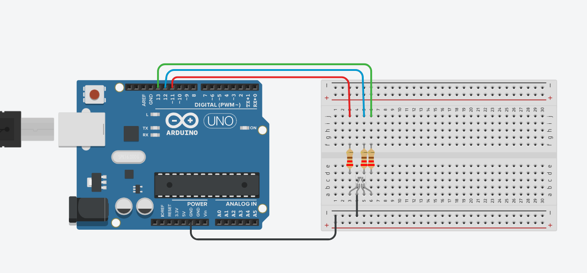

I. Elabora el siguiente esquema en la Protoboard.

II. Crea una interfaz que permita solicitar por consola al usuario, un color en específico (Ver
tabla de colores RGB), y en base al color ingresado o seleccionado, el LED deberá
encender

Diseño del esquema: [Semaforo](https://www.tinkercad.com/things/0xEBwyWEo0K-terrific-bruticus-krunk/editel?sharecode=SOOnjIKYJUnOZI5iw3fgkpB_0HTOqUAXiRnbaEKWNyI)
